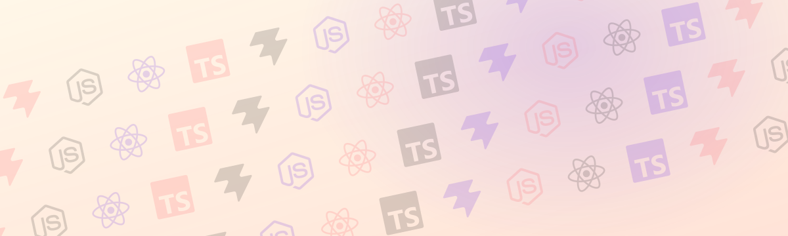
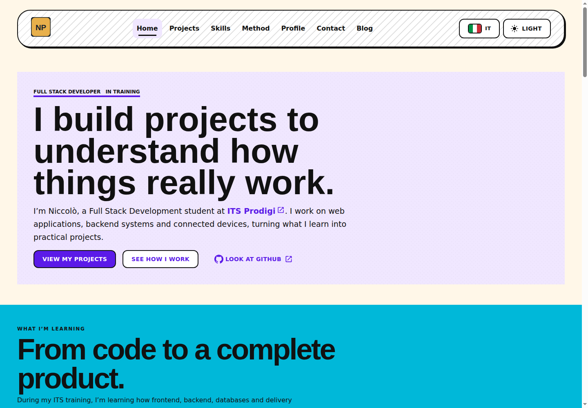
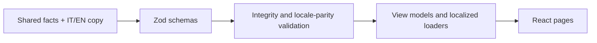

<h1 align="center">
  
</h1>

<p align="center">
  <a href="#project-structure"></a>
  <a href="https://github.com/pianic2/its-react-portfolio-web/actions/workflows/quality.yml"></a>
  <a href="https://pianic2.github.io/its-react-portfolio-web/"></a>
  <a href="docs/README.md"></a>
</p>

Bilingual (Italian/English) portfolio for projects, technical capabilities, and an evidence-based engineering method.

<p align="center">
  
</p>

## Quick Start

Requires Node.js 24 and npm.

```bash
npm ci
npm run dev
```

Copy `.env.example` to `.env.local` to configure the backend URL and optional integrations. See [local setup](docs/getting-started/setup.md).

## Architecture

A single-page React application built with Vite, Material UI and React Router. Portfolio copy lives in a validated content layer, not in components:



Details: [content model](docs/architecture/content-model.md) · [design system tokens](docs/architecture/design-system/tokens.md) · [shared primitives](docs/architecture/design-system/shared-primitives.md).

## Development

| Command                    | Purpose                                                    |
| -------------------------- | ---------------------------------------------------------- |
| `npm run dev`              | Start the Vite dev server                                  |
| `npm run test`             | Run the Vitest suite                                       |
| `npm run content:validate` | Validate bilingual content                                 |
| `npm run check`            | Full quality gate: static checks, tests, build and budgets |

The same `npm run check` runs in the [Quality workflow](.github/workflows/quality.yml). See [quality gates](docs/development/quality-gates.md).

## Deployment

After Quality passes on `main`, the [Pages workflow](.github/workflows/pages.yml) publishes the site to [GitHub Pages](https://pianic2.github.io/its-react-portfolio-web/) under `/its-react-portfolio-web/`. See the [deployment guide](docs/operations/github-pages.md).

## Project Structure

```text
src/
├── app/         # Application shell, layout and focus management
├── components/  # Shared actions, layout, navigation and surfaces
├── content/     # Schemas, IT/EN data, validation, view models and loaders
├── features/    # Page sections (home, projects, method, blog, contact, …)
├── pages/       # Route-level page composition
├── routes/      # Localized route config and sitemap
├── services/    # Backend and contact adapters
├── seo/         # Metadata contract
└── theme/       # Digital Studio tokens and MUI theme
scripts/         # Architecture, release, bundle and performance checks
docs/            # Documentation index: docs/README.md
```
