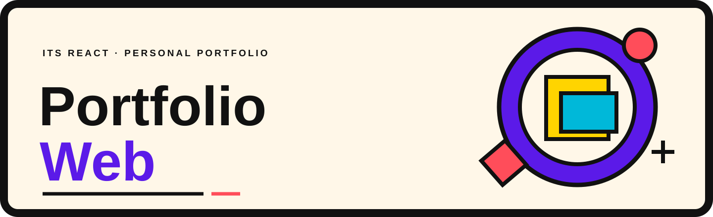

<p align="center">
  
</p>

<h1 align="center">ITS React Portfolio Web</h1>

<p align="center">A bilingual React portfolio for presenting projects, skills, and engineering practice.</p>

<p align="center">
  <a href="https://github.com/pianic2/its-react-portfolio-web/actions/workflows/quality.yml"></a>
</p>

<p align="center">
  <a href="https://react.dev/"></a>&nbsp;&nbsp;
  <a href="https://www.typescriptlang.org/"></a>&nbsp;&nbsp;
  <a href="https://vite.dev/"></a>&nbsp;&nbsp;
  <a href="https://mui.com/"></a>
</p>

## Quick start

Requires Node.js `>=24 <25` and npm.

```bash
npm ci
npm run dev
```

## Architecture

| Area                           | Responsibility                                             |
| ------------------------------ | ---------------------------------------------------------- |
| `src/app` and `src/routes`     | Application shell and localized route wiring               |
| `src/content`                  | Italian and English content, Zod validation, and page data |
| `src/pages` and `src/features` | Page composition and reusable portfolio sections           |
| `src/services`                 | Backend and contact adapters                               |
| `src/theme`                    | Shared Material UI theme and design tokens                 |

The content layer validates data before pages consume it. Stable project IDs stay separate from translated copy and localized slugs.

## Development

| Command         | Purpose                           |
| --------------- | --------------------------------- |
| `npm run dev`   | Start the Vite development server |
| `npm run test`  | Run the Vitest suite              |
| `npm run lint`  | Check lint rules                  |
| `npm run check` | Run the complete quality gate     |

The same `npm run check` command is used by the [Quality workflow](.github/workflows/quality.yml).

## Deployment

The portfolio is published on [GitHub Pages](https://pianic2.github.io/its-react-portfolio-web/). The [deployment guide](docs/deployment/github-pages.md) documents route recovery and the production base path, `/its-react-portfolio-web/`.

## Project docs

- [Content model](docs/content/irpw-9-content-model.md)
- [GitHub Pages deployment and route recovery](docs/deployment/github-pages.md)
- [Design tokens](docs/design-system/tokens.md)
- [Portfolio Web wordmark](docs/assets/logo.svg)
